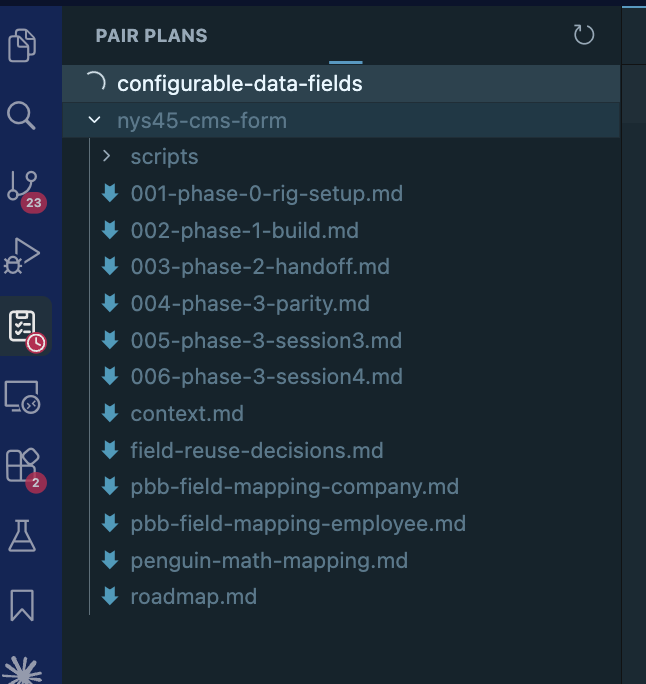

# Pair Plans

A focused sidebar view for `.pair-plans/` folders — the working plan docs produced during `/pair` sessions (see the `ruby-programming:pair` skill).



## Why this exists

`.pair-plans/` holds the roadmap and per-phase plans a `/pair` session writes as it works. These are **deliberately not committed** — they're working documents and session-handoff state, not team-facing artifacts (the PR description is the durable record). Because they stay out of your commits, they never show up in Source Control and are easy to lose track of in the file tree.

This extension gives them a dedicated home: a **Pair Plans** view in the activity bar that surfaces the current feature's roadmap and phase plans, so they stay one click away while you pair — handy, but still uncommitted.

## What it does

Adds a **Pair Plans** icon to the activity bar (next to Explorer, Search, Source Control). It auto-detects a `.pair-plans/` directory in any open workspace folder and shows a tree of the plans:

- Folder structure is mirrored as expandable nodes.
- Files are listed by filename.
- Click a file to open it.
- The view refreshes automatically when files under `.pair-plans/` change; a manual **Refresh** button lives in the view header.

Works in both VS Code and Cursor (Cursor is a VS Code fork using the same extension API).

## Install

The packaged `.vsix` is not checked in (it's gitignored), so build it first, then install the result:

```bash
npx @vscode/vsce package                              # produces pair-plans-<version>.vsix

cursor --install-extension pair-plans-0.0.2.vsix      # Cursor
code   --install-extension pair-plans-0.0.2.vsix      # VS Code
```

Or via the UI: **Extensions** panel → `…` menu → **Install from VSIX…**, pick the built `.vsix`, then reload the window.

## Build

```bash
npx @vscode/vsce package
```
